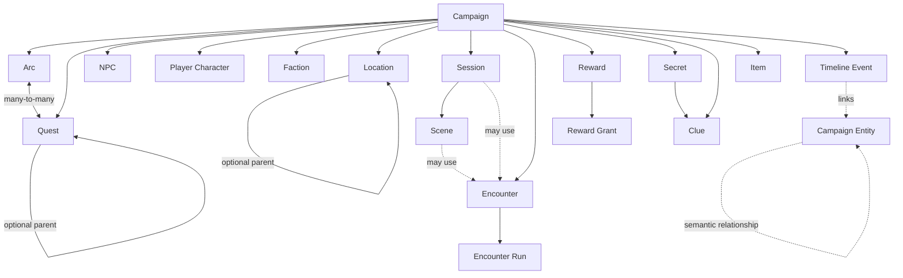

# Domain Model

This document describes the campaign concepts the application needs to reason about. It is intentionally conceptual: database-level details belong in [Architecture](architecture.md), and product behavior belongs in [Product](product.md).

## Modeling principles

- Campaign is the ownership boundary.
- First-class concepts should be independently addressable when the GM may reuse, connect, archive, restore, or track them.
- Known structural relationships should be explicit.
- Flexible semantic relationships should remain flexible.
- Current state, narrative history, and technical history are separate concepts.
- Reorganization should be non-destructive.
- Campaign Core remains independent from any specific TTRPG ruleset.

## Conceptual map

The diagram is illustrative, not a complete ER model.

## Campaign

Campaign is the top-level user-owned aggregate for campaign content.

It owns the world and preparation entities described below, lifecycle state, the selected/pinned Ruleset Version, and the Campaign Compass.

The initial implementation has one internal owner per Campaign.

## Campaign Compass

Campaign Compass stores long-lived guidance such as premise, tone, themes, boundaries, and current direction.

It exists so assistance can understand what the GM is trying to build without treating a generated interpretation as more authoritative than the GM's own material.

## Blueprint Draft

Blueprint Draft is a pre-Campaign structured work artifact used during campaign creation.

It is intentionally separate from persisted Campaign truth. A GM can edit or partially accept it. Materialization into Campaign entities is transactional and must not recreate rejected nodes indirectly through dependencies.

## Narrative structure

### Arc

A broad narrative grouping or long-running thread.

Arcs and Quests are independent. A Quest may belong to multiple Arcs or no Arc, and an Arc may contain many Quests.

### Quest / Plot Thread

A concrete goal, problem, opportunity, or thread the GM wants to track.

A Quest can have one structural parent and multiple children. Parent/child hierarchy is for structure, not ownership: detaching a child does not delete it.

Quest outcomes and state should support the fact that tabletop play can resolve, fail, postpone, abandon, or transform plans.

## World

### NPC

A campaign character controlled by the GM.

NPC current state belongs in the NPC model; significant changes can also appear in Timeline history. NPCs can participate in factions, relationships, locations, quests, encounters, secrets, clues, and sessions without those systems owning the NPC.

### Player Character

A lightweight campaign representation of a player character.

The product is not a full character builder. The MVP stores only campaign-relevant identity/state needed for sessions, relationships, knowledge, rewards, and rules analysis.

### Faction

An organization, group, institution, or other collective actor in the campaign.

Faction membership is separate from the Faction so membership can retain role/rank and active/former history.

### Location

A place in the campaign world.

Locations may have one structural parent for containment/navigation. Additional connections belong in Travel Routes or semantic Relationships rather than forcing every spatial concept into one hierarchy.

Location hierarchy must reject cycles.

### Travel Route

A meaningful connection between Locations with travel-oriented information such as distance, duration, mode, hazards, or GM notes.

It can later support continuity checks without making travel simulation a prerequisite for the MVP.

### Item

An important campaign item, including items the GM wants to track independently of the ruleset.

A tracked Item may have at most one direct current locator: a holder entity, a Location, or neither if its location is unknown. Its location may be derived transitively through its holder instead of storing redundant state.

## Play and preparation

### Party

A lightweight group of Player Characters used for normal campaign composition and mechanical context.

Session attendance is separate so an absence in one session does not rewrite the normal Party.

### Session

A preparation and play container for one table session.

The product needs both pre-session intent and post-session reality. A Session can be prepared, run, and then updated with what actually happened.

Scrapping a Session should preserve reusable preparation rather than deleting its Scenes, Encounters, or campaign entities.

### Scene

An optional preparation unit inside a Session.

Scenes can exist without a Session and can be moved when plans change. They are organizational aids, not mandatory narrative structure.

### Encounter

A reusable definition of a meaningful challenge, most commonly but not exclusively combat.

An Encounter exists independently of where it is planned. `Encounter Placement` represents a use of that definition in a Session or Scene so the same Encounter can be reused or appear multiple times.

### Encounter Run

A record of an Encounter that actually occurred.

It may reference a planned placement or represent an improvised encounter. It freezes enough execution context that later edits to the reusable Encounter definition do not rewrite play history.

## Information and knowledge

### Secret

A piece of hidden campaign truth or information.

### Clue

A discoverable piece of information that can point toward Secrets, quests, people, places, or other campaign concepts.

### Knowledge state

Knowledge is modeled between information and a Campaign entity that knows it. The holder may be a PC, NPC, Faction, Party, or another supported entity type.

The MVP can distinguish states such as suspected, partial, and known.

Narratively important changes to knowledge can be recorded in the Timeline rather than creating a second event-sourcing system.

## Rewards

### Reward

A planned reward package. Rewards are broader than loot: money, items, information, reputation, favors, access, progression, and narrative outcomes may all be meaningful.

### Reward Component

One independently resolvable part of a Reward.

### Reward Grant

A record of what was actually received, by whom, and when. This keeps preparation separate from play history.

## Timeline and history

### Timeline Event

A narratively meaningful event in the campaign world or at the table.

Timeline is used to understand what happened and how entities changed over time. It does **not** reconstruct the entire application state and is not an audit log.

An event can link to multiple Campaign entities and can retain readable historical context even if a live entity is later purged.

### Technical change history

Technical undo/history is separate from Timeline.

Selected high-impact application operations can record Change Sets with before/after snapshots and conflict detection. These exist to safely reverse software operations, not to represent campaign fiction.

A5 persists `change_set` with Campaign ownership, internal creator provenance,
and paired reversion timestamp/user fields. It has no soft-delete fields; deleting
its Campaign cascades to Change Sets and their entries. User references restrict
deletion. A Change Set does not require a command execution or AI proposal.

Each `change_set_entry` has a positive, unique order within its Change Set and a
positive snapshot schema version (default 1). INSERT requires only an after
snapshot, UPDATE requires both, and DELETE requires only a before snapshot.
Snapshots must be JSON objects and are technical, versioned undo payloads, not
generic database copies or a full history/event-sourcing model. An optional
expected current revision must be positive. At least one of `entity_id` or
`object_id` identifies the target alongside a non-empty `object_kind`; neither ID
references live domain rows, so entries can describe created or removed objects.

Actual undo is pending. It will apply atomically or abort entirely if any affected
object has diverged; A5 stores the foundation without executing that workflow.

## Relationships

### Structural relationships

Known structures use explicit models: Quest hierarchy, Location hierarchy, Arc↔Quest, membership, attendance, travel, clue links, Encounter placement, and Reward grants.

### Semantic Relationship

A flexible typed connection between two Campaign entities, for example:

- allied with;
- rival of;
- protects;
- owes;
- fears;
- related to;
- knows;
- custom GM-defined semantics.

Relationships form a graph and are not required to be acyclic. Their type is data, allowing custom semantics without schema changes.

User-visible entity names are not unique IDs, and apparently duplicate semantic relationships are not automatically invalid: repeated semantics can be meaningful in context.

## Current state vs history

The model deliberately separates:

1. **Current accepted state** — typed Campaign entities and current relationships;
2. **Narrative history** — Timeline Events, Encounter Runs, Reward Grants, and other records of what occurred;
3. **Technical history** — Change Sets used for safe operation undo.

This avoids forcing normal application state into event sourcing while still preserving narrative history and selected technical reversibility.

## Ruleset boundary

Campaign Core stores campaign meaning, not D&D mechanics.

Ruleset-specific data such as mechanical definitions and deterministic calculations belongs behind the Ruleset Adapter. Campaigns pin an immutable published Ruleset Version so a future update does not silently reinterpret existing campaign mechanics.

## AI and source of truth

AI output is not Campaign truth by default.

Generated changes are represented as proposals with enough target/revision context to detect stale state. Acceptance validates the complete proposal before applying it transactionally.

The GM can accept, edit, reject, regenerate, or ignore generated material.

## Lifecycle

First-class Campaign entities support four distinct concepts:

- **Active** — normal working state;
- **Archived** — retained but hidden from normal active views;
- **Trash** — explicitly deleted but recoverable during retention;
- **Purged** — permanently removed.

Archive and Trash are independent. Restoring an entity that was archived before deletion returns it to Archived state.

A whole Campaign can also be archived, trashed, restored, or permanently purged. Campaign deletion must account for retention of already-trashed child entities rather than allowing background cleanup to destroy part of a Campaign while the Campaign itself remains restorable.
